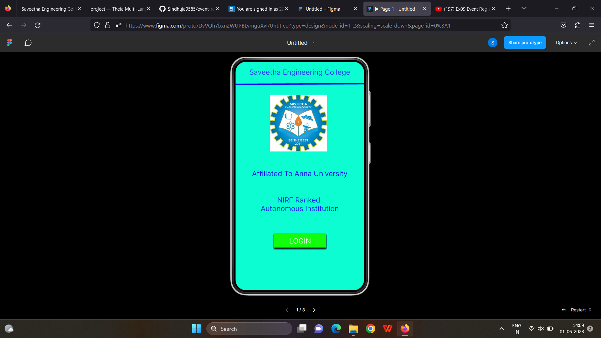
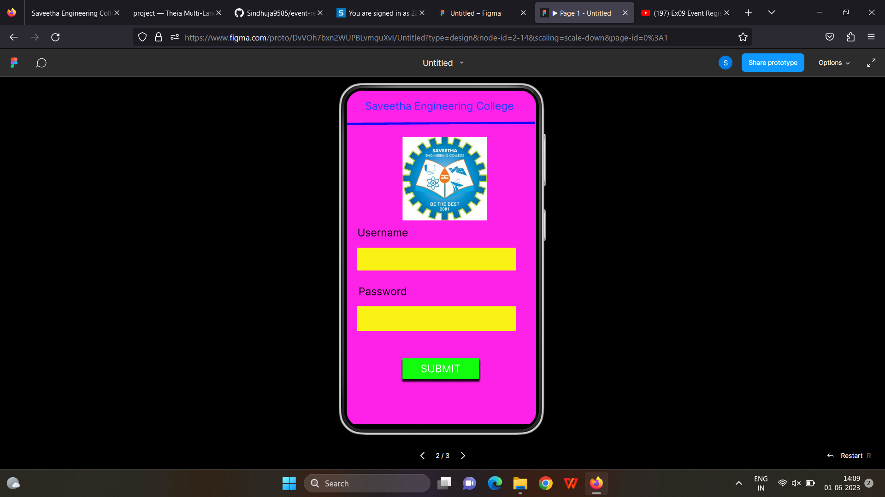
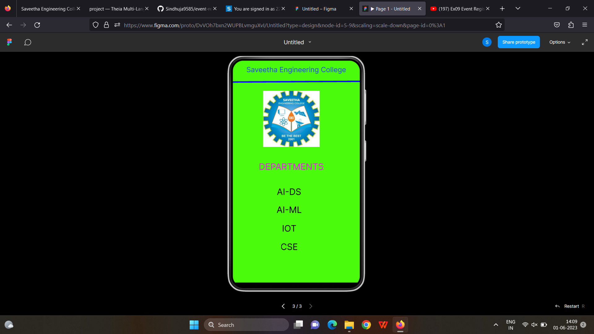

# Event Registration Web Application

## AIM:
To design, develop and deploy a web application for event registration.

## DESIGN STEPS:

### Step 1:
Create a new frame.

### Step 2:

Select any one present size on your choice.

### Step 3:

Select the shape you need.

### Step 4:

Import image as need.

### Step 5:

Create pages based on your need and link them.

### Step 6:

Validate the HTML and CSS code.

### Step 7:

Publish the website in the given URL.

## DESIGN:

figma

## PROGRAM :
'''

/* home page */

position: relative;

width: 360px;

height: 640px;

background: #0DFDD2;

box-shadow: 0px 4px 4px rgba(0, 0, 0, 0.25);

/* Saveetha Engineering College */

position: absolute;
width: 284px;

height: 31px;

left: 38px;

top: 17px;

font-family: 'Inter';

font-style: normal;

font-weight: 400;

font-size: 20px;

line-height: 24px;

text-align: center;

color: #243AFE;

/* Line 1 */

position: absolute;

width: 360.01px;

height: 0px;

left: 0px;

top: 65px;

border: 4px solid #0E09FD;

transform: rotate(-0.32deg);

/* LOGO PAGE 1 */

position: absolute;

width: 160px;

height: 159px;

left: 96px;

top: 92px;

background: url(LOGO PAGE.png);

/* Affiliated To Anna University */

position: absolute;

width: 284px;

height: 31px;

left: 38px;

top: 301px;

font-family: 'Inter';

font-style: normal;

font-weight: 400;

font-size: 20px;

line-height: 24px;

text-align: center;

color: #1510F7;

/* NIRF Ranked Autonomous Institution */

position: absolute;

width: 284px;

height: 55px;

left: 38px;

top: 375px;

font-family: 'Inter';

font-style: normal;

font-weight: 400;

font-size: 20px;

line-height: 24px;

text-align: center;

color: #1027F5;

/* Rectangle 1 */

position: absolute;

width: 146px;

height: 40px;

left: 108px;

top: 480px;

background: #12FC0E;

box-shadow: 0px 4px 4px rgba(0, 0, 0, 0.25), 0px 4px 4px rgba(0, 0, 0, 0.25), 0px 4px 4px rgba(0, 0, 0, 0.25), 0px 4px 4px rgba(0, 0, 0, 0.25), 0px 4px 4px rgba(0, 0, 0,
0.25), 0px 4px 4px rgba(0, 0, 0, 0.25), 0px 4px 4px rgba(0, 0, 0, 0.25), 0px 4px 4px rgba(0, 0, 0, 0.25);

/* LOGIN */

position: absolute;

width: 108px;

height: 24px;

left: 127px;

top: 490px;

font-family: 'Inter';

font-style: normal;

font-weight: 400;

font-size: 20px;

line-height: 24px;

text-align: center;

color: #FFFFFF;

/* login page */

position: relative;

width: 365px;

height: 635px;

background: #FE21E8;

box-shadow: 0px 4px 4px rgba(0, 0, 0, 0.25);

/* Saveetha Engineering College */

position: absolute;

width: 284px;

height: 31px;

left: 34px;

top: 17px;

font-family: 'Inter';

font-style: normal;

font-weight: 400;

font-size: 20px;

line-height: 24px;

text-align: center;

color: #243AFE;

/* Line 2 */

position: absolute;

width: 358.01px;

height: 0px;

left: 0px;

top: 65px;

border: 4px solid #0E09FD;

transform: rotate(-0.32deg);

/* LOGO PAGE 2 */

position: absolute;

width: 160px;

height: 159px;

left: 106px;

top: 88px;

background: url(LOGO PAGE.png);

/* Username */

position: absolute;

width: 155px;

height: 31px;

left: -9px;

top: 258px;

font-family: 'Inter';

font-style: normal;

font-weight: 400;

font-size: 20px;

line-height: 24px;

text-align: center;

color: #000000;

/* Rectangle 2 */

position: absolute;

width: 302px;

height: 43px;

left: 20px;

top: 299px;

background: #FBF215;

/* Password */

position: absolute;

width: 97px;

height: 30px;

left: 20px;

top: 370px;

font-family: 'Inter';

font-style: normal;

font-weight: 400;

font-size: 20px;

line-height: 24px;

text-align: center;

color: #000000;

/* Rectangle 3 */

position: absolute;

width: 302px;

height: 47px;

left: 20px;

top: 410px;

background: #FBF215;

/* Rectangle 2 */

position: absolute;

width: 146px;

height: 40px;

left: 106px;

top: 509px;

background: #12FC0E;

box-shadow: 0px 4px 4px rgba(0, 0, 0, 0.25), 0px 4px 4px rgba(0, 0, 0, 0.25), 0px 4px 4px rgba(0, 0, 0, 0.25), 0px 4px 4px rgba(0, 0, 0, 0.25), 0px 4px 4px rgba(0, 0, 0,
0.25), 0px 4px 4px rgba(0, 0, 0, 0.25), 0px 4px 4px rgba(0, 0, 0, 0.25), 0px 4px 4px rgba(0, 0, 0, 0.25);

/* SUBMIT */

position: absolute;

width: 93px;

height: 24px;

left: 132px;

top: 517px;

font-family: 'Inter';

font-style: normal;

font-weight: 400;

font-size: 20px;

line-height: 24px;

text-align: center;

color: #FFFFFF;

/* SEC Page */

position: relative;

width: 364px;

height: 629px;

background: #4AFC0C;

box-shadow: 0px 4px 4px rgba(0, 0, 0, 0.25);

/* Saveetha Engineering College */

position: absolute;

width: 284px;

height: 31px;

left: 38px;

top: 14px;

font-family: 'Inter';

font-style: normal;

font-weight: 400;

font-size: 20px;

line-height: 24px;

text-align: center;

color: #243AFE;

/* Line 3 */

position: absolute;

width: 364.01px;

height: 0px;

left: 0px;

top: 63px;

border: 4px solid #0E09FD;

transform: rotate(-0.31deg);

/* LOGO PAGE 3 */

position: absolute;

width: 160px;

height: 159px;

left: 86px;

top: 86px;

background: url(LOGO PAGE.png);

/* DEPARTMENTS */

position: absolute;

width: 184px;

height: 30px;

left: 74px;

top: 286px;

font-family: 'Inter';

font-style: normal;

font-weight: 400;

font-size: 25px;

line-height: 30px;

text-align: center;

color: #F40FF9;

/* AI-DS */

position: absolute;

width: 141px;

height: 31px;

left: 89px;

top: 357px;

font-family: 'Inter';

font-style: normal;

font-weight: 400;

font-size: 25px;

line-height: 30px;

/* identical to box height */

text-align: center;

color: #000000;

/* AI-ML */

position: absolute;

width: 92px;

height: 33px;

left: 114px;

top: 408px;

font-family: 'Inter';

font-style: normal;

font-weight: 400;

font-size: 25px;

line-height: 30px;

text-align: center;

color: #000000;

/* IOT */

position: absolute;

width: 80px;

height: 32px;

left: 120px;

top: 461px;

font-family: 'Inter';

font-style: normal;

font-weight: 400;

font-size: 25px;

line-height: 30px;

text-align: center;

color: #000000;

/* CSE */

position: absolute;

width: 50px;

height: 30px;

left: 135px;

top: 513px;

font-family: 'Inter';

font-style: normal;

font-weight: 400;

font-size: 25px;

line-height: 30px;

text-align: center;

color: #000000;

'''

## OUTPUT:

## Result:

The program to design ,develop and deploy a web application for event registration is completed successfully.
